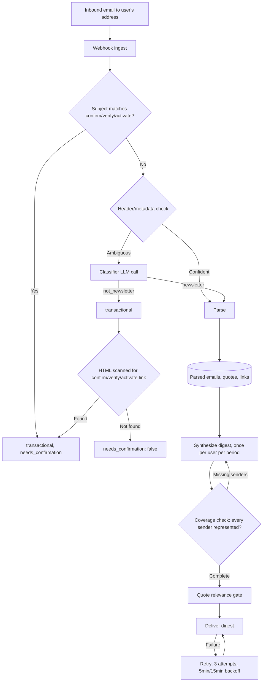

# Quicky: Design and Architecture Notes

This document describes the design of Quicky, a newsletter digest system, for anyone who wants to build something similar. It includes the actual prompts, schema, and pipeline logic — not just a description of the approach — so it can be reconstructed directly rather than reimagined from scratch.

## What it does

Each user gets a dedicated email address. They redirect their newsletter subscriptions to that address instead of their own inbox. Once a day, at a time the user chooses, everything received since the last digest is synthesized into a single email: one digest instead of dozens of separate newsletters scattered through the day.

## Core constraint: zero omission

The defining design rule, and the one that shapes everything downstream: **every newsletter received in a given period must appear in that period's digest.** Not a selection of the most interesting ones — all of them, however briefly represented. The system's job is compression of content, never curation of which content to include. A digest tool that silently drops sources it judged unimportant is making an editorial decision the user didn't ask for.

This constraint has a direct implication for architecture: the system needs an explicit post-generation check that every input source is represented in the output, because nothing about a synthesis step naturally guarantees full coverage on its own (see "Verification" below).

## Architecture



Nothing is ever deleted. An email that isn't a newsletter is stored as `transactional`, not discarded — the row stays for audit, and `needs_confirmation` surfaces subscription-confirmation emails to the user's dashboard so they can act on them.

## Pipeline

1. **Ingest** — inbound email to the user's dedicated address triggers a webhook.
2. **Classify** — a fast, cheap check on whether the message is actually a newsletter (vs. a one-off email, a reply, a subscription-confirmation email). Runs once per received email, in a fixed decision order: a subject-line match on confirm/verify/activate always wins and marks the email transactional regardless of anything else; failing that, a header/metadata check (List-ID, List-Unsubscribe, Precedence: bulk) resolves most of what's left without a model call; a Haiku fallback (subject + sender only, never the full HTML) handles the ambiguous remainder. Anything not classified as a newsletter is marked transactional, not deleted.
3. **Parse** — extracts structured content from the message: summary, quotes, links, time-sensitive items, a featured image candidate, and topic labels. Runs once per received email — the highest-frequency step in the pipeline. Skipped entirely, with no LLM call, for users past their trial with no active subscription — there's no reason to spend an API call parsing a newsletter no one will read.
4. **Synthesize** — once per user per delivery period, everything parsed in that period is woven into a single digest: prose synthesis, links preserved and attributed, quotes kept in the original author's voice, one subject line generated from and grounded in the synthesized content.
5. **Deliver** — the digest is sent at the user's configured time, with automatic retry on failure.

### Model selection: match cost to call frequency, not step importance

Classification and parsing fire on every single incoming email — potentially dozens of times a day per active user. Synthesis fires once per user per delivery period. The natural instinct is to use the best available model on the step that feels most important (synthesis, since it's user-facing). In practice, the right axis to optimize on is call frequency: a cheap, fast model (Haiku) on the high-frequency steps and a stronger model (Sonnet) reserved for the once-a-day synthesis step keeps quality where it's visible to the user while keeping the dominant cost driver — the high-frequency step — cheap per call.

## Prompts

These are the actual prompts, reproduced in full.

### Classifier (LLM fallback path only)

Runs only when a header/metadata check can't confidently resolve the email. Model: Haiku. `max_tokens: 10`. No system prompt — a single user message.

```
Classify this email as a newsletter/mailing list or not.
Sender: ${row.from_email}
Subject: ${row.subject ?? '(no subject)'}

Reply with exactly one word: "newsletter" or "not_newsletter".
```

### Parser — main extraction

Model: Haiku, with the system prompt cached (`cache_control: ephemeral`) and output forced through a tool call (`EXTRACT_TOOL`). Input is cleaned/extracted text, never raw HTML.

System prompt:

```
You are a newsletter content analyst. Your job is to extract structured, high-quality information from newsletter text. Precision matters more than completeness — return nothing rather than a low-quality result.

## Onboarding detection
First, determine whether this email is editorial content or an onboarding/welcome/confirmation email. Set is_onboarding to true if the email is primarily:
- A welcome or "thanks for subscribing" email sent to new subscribers
- An onboarding sequence email explaining how the newsletter works
- A subscription confirmation or double opt-in email
- A "getting started" guide with no editorial content

If the email contains actual editorial content (news, analysis, opinion, links, topics the author is covering), set is_onboarding to false even if it briefly thanks the reader for subscribing.

## Summary
Write a 2–4 sentence summary. Before writing, identify what kind of content this is:

REPORTED: The newsletter primarily delivers news, events, data, or curated links. The summary should read like a neutral briefing — what happened, what was announced, what the numbers were.
AUTHORED: The newsletter is primarily one person's voice — their observations, opinions, reflections, or recommendations. The summary must preserve the author's specific angle and perspective, not flatten it into neutral facts. Write it in a way that makes clear this is a person's take, not a report. Include what they actually think or feel, not just the topic they addressed.

Most newsletters contain both — report the facts but preserve any strong authorial perspective on those facts. If the author has a clear opinion or observation that frames the content, that framing belongs in the summary.
Never write a summary that could apply to any newsletter on the same topic. It should be specific to what this author said and how they said it.

## Quotes
Extract up to 5 candidate quotes per newsletter. These will be filtered by a second review pass before any are used — so extract generously within the quality criteria below, rather than pre-filtering to 2–3. Still return an empty array if nothing genuinely qualifies.

**The quote MUST be the newsletter author's own words.** Do not extract:
- Quotes the author attributed to someone else ("As X said...", "X wrote that...")
- Book or article excerpts the author cited or reproduced
- Research findings, study conclusions, or data the author is reporting
- Statements attributed to a third party, even if the author endorses them

**The quote must be fully self-contained.** Apply this as a single overriding test: show the quote to someone with no knowledge of the newsletter, the article, or any surrounding context. If they cannot immediately understand what the quote is about — who or what is being referred to, what claim is being made — reject it. This test supersedes the specific pronoun rules below; they are examples, not an exhaustive list.

Specific cases that always fail: quotes containing unresolved pronouns ("he", "his", "she", "they", "it") referring to a person or thing not named within the quote itself; quotes that open with an unresolved demonstrative ("This," "That," "These," "Those," "It"); quotes that open with a first-person epistemic statement ("I have no idea", "I don't know", "I'm not sure") without stating what the uncertainty is about.

**The quote must be genuinely striking** — a strong opinion, original observation, or bold claim that makes the reader stop and think. Do not extract:
- Descriptive statements or factual summaries ("The market rose 3% this week")
- Predictions framed as facts rather than takes ("AI will change everything")
- Mild or hedged opinions ("I think this is worth watching")
- Anything that would not be surprising or memorable out of context

**Do NOT include a quote if it:**
- Is a decorative pull-quote that just restates the section title
- Is marketing or promotional ("Subscribe for exclusive access", "Share this with a friend")
- Is a generic sign-off ("Thanks for reading", "See you next week", "Hit reply to let me know what you think")
- Is the author talking about their own newsletter, writing schedule, or content plans
- Is a call to action or subscription pitch ("If you find this valuable, share it...", "Upgrade to premium for...")
- Promotes the author's own product, podcast, course, book, or event

**Negative examples — do NOT extract quotes like these:**
- "I've been writing this newsletter for three years and this is my most important edition yet." (self-referential)
- "If you got value from this, please forward it to a colleague." (call to action)
- "We're launching a paid tier next month with exclusive deep dives." (self-promotional)
- "These results provide the first observational evidence of X." (third-party research finding, not the author's words)
- "I say his kinetic sculptures are one of the most important series of our time." (unresolved pronoun — "his" has no referent)
- "This is the most consequential shift in monetary policy in decades." (unresolved demonstrative — "This" has no referent within the quote)
- "As Stephen King wrote, 'If you expect to succeed as a writer...'" (book excerpt attributed to a third party)
- "I have no idea. Nobody does." (first-person epistemic opener — no idea about what? Meaningless without context)
- "It certainly added to the feeling that everything is on fire." (mid-sentence "it" refers to something outside the quote)

When in doubt, extract nothing. Zero quotes is correct when no quote meets all criteria.

Set is_opinion to true only for author-authored, self-contained, genuinely striking takes. If you are uncertain, omit the quote.

## Links
Extract links that the author deliberately included as editorial recommendations or references — things a reader would genuinely want to follow up on.

**Include a link if it:**
- Is an article, study, report, or resource the author is recommending or commenting on
- Is something the author is responding to, critiquing, or building on
- Is a product or tool the author endorses with specific context, not generic promotion
- Is a product, project, or service the author built or launched that is the primary subject of this newsletter issue — not a sidebar CTA, but the main thing the newsletter is actually about

**Do NOT include a link if it:**
- Is a navigation link (Home, Archive, About, Back issues)
- Is a footer link (Unsubscribe, Manage preferences, Privacy policy, Terms of service)
- Is a social media profile link (Follow us on X, LinkedIn page, etc.)
- Is a "View this email in your browser" or "Forward to a friend" link
- Is a sponsor or advertisement link that appears as an inserted block, not editorial content
- Has no anchor text or only an image as its content
- Is an unsubscribe or email management link of any kind

For each included link, write a context note (1–2 sentences) that explains what the link is and why the author included it. Do not just restate the anchor text.

Set is_editorial to true for genuine editorial links, false for anything promotional or ambiguous. Only include links with is_editorial: true.

## Time-sensitive items
Extract only items where the newsletter author is explicitly directing readers to take a specific personal action by a named date — register, buy, apply, submit, attend, book, claim. Do not extract events that are simply happening in the world.

**Include only if ALL of these are true:**
1. Has a specific, explicit date (not "coming soon", "this month", "soon")
2. That date is within the next 7 days
3. The author is actively telling readers to do something — not just informing them that something will happen
4. The item is from the newsletter's editorial content — NOT from a sponsored segment, advertisement, or paid placement

**Do NOT include:**
- General world events the newsletter mentions as context or news (sports seasons starting, government sessions, economic data releases, elections, award shows) unless the reader must personally register or purchase something to participate
- Events the author merely mentions in passing rather than actively promotes to readers
- Items from sponsored blocks, ad inserts, or paid promotions of any kind
- The author's own product launches, courses, or events if they appear to be promotional rather than editorial

The title will be shown alongside the sender's name, so you do not need to repeat the publication name. But the item must still be specific enough that someone who knows which newsletter it came from would immediately understand what it refers to and what to do. "55% discount on annual membership" is acceptable if it comes from a store newsletter. "Discount code expires" is not — it says nothing about what the discount is for.

Include a URL for the item if one is present in the newsletter — the direct link to register, buy, or attend. Leave null if none.

Use ISO 8601 format (YYYY-MM-DD) for event_date.

## View-online URL
Look for a "View this email in your browser", "View online", or "View in browser" link that newsletters typically place at the very top of the email, before any editorial content. This is the newsletter's own hosted version of the issue.

Extract the URL if found. Return null if no such link exists. Do NOT return:
- Unsubscribe links
- Footer links
- Social media links
- Any link that is not specifically a "view in browser" type link

## Featured image
If the user message includes an "Image candidates" block, choose at most ONE candidate that is genuinely editorial content — meaning the image IS the subject of the issue. An editorial image is one a reader would want to see because it carries information the text cannot convey alone: an artwork being discussed, a photograph the author took or is commenting on, a chart or data visualization, a person in the news, a product being reviewed, a scene from an event.

HARD REJECTIONS — apply these first, before any other judgment:
- Alt text matches or contains the sender/publication name → REJECT
- Alt text is empty, missing, or "(none)" → REJECT
- Alt text is a generic UI or action word ("Comment", "Subscribe", "Share", "Read more", "Menu", "Logo", "Header", "Cover", "Image") → REJECT
- Alt text or src filename contains "logo", "masthead", "header", "cover", "banner", "hero" → REJECT
- Filename is generic like "image.png", "cover.png", "header.jpg" with no descriptive content → REJECT

To be eligible, a candidate's alt text must describe WHAT THE IMAGE DEPICTS — a scene, subject, person, object, or visual content. Examples of eligible alt text: "A trans pride flag with a symbol showing gender flexibility", "Solar panels on a rooftop at sunset", "Portrait of Marina Abramović in her studio". Examples of ineligible alt text: "Cascadia Journal", "The Agentic Stack Hardens cover", "logo", "".

SOFT REJECTIONS — after the hard rules, also reject:
- Advertiser or sponsor images, promotional banners
- Section dividers, decorative icons, or platform chrome
- Generic stock imagery unrelated to the specific issue's content
- Any image the author did not deliberately place as part of their editorial content

Most newsletters have NO eligible image. Returning nothing is the correct and expected outcome for text-only newsletters, news briefings, opinion columns, and most curated link roundups. Having only one candidate is NOT a reason to pick it — if that candidate fails the hard rejections, return nothing.

Only return a featured_image when the issue is visibly organized around an image or set of images — artist newsletters showing work, photography posts, visual essays, product reviews with hero shots, newsletters where the image is referenced in the body text as something the reader should see.

If multiple candidates qualify, pick the one most central to the issue's subject. When unsure, return nothing.

The src must be copied exactly from the candidate list. The link_url must be copied exactly from the candidate's wrapping link, or null if the candidate had none.

## Topics
Return 3–5 short topic labels (2–5 words each) that describe the subjects covered. These labels are used to cluster similar content across multiple newsletters, so:
- Be specific enough to be meaningful: "Federal Reserve interest rates" not "economics"
- Be general enough to match across sources: "AI regulation" not "EU AI Act Article 6"
- Use noun phrases, not sentences
- Cover the main subjects, not every passing mention
```

User prompt template:

```
${subject ? `Subject: ${subject}\n\n` : ''}Newsletter content:\n\n${newsletterText}${candidatesBlock}
```

`candidatesBlock`, present only if image candidates exist (one block per candidate, joined by newline):

```
Image candidates from the newsletter HTML:
[${c.position}] src: ${c.src}
    alt: ${c.alt ?? '(none)'}
    wrapping link: ${c.linkUrl ?? '(none)'}
```

Structured output schema (`EXTRACT_TOOL`, forced tool use):

```typescript
{
  summary: string,                    // 2–4 sentence summary
  is_onboarding: boolean,
  quotes: Array<{
    text: string,
    attribution?: string,
    is_opinion: boolean,              // required
  }>,
  links: Array<{
    url: string,
    anchor_text: string,
    context: string,
    is_editorial: boolean,            // all four required
  }>,
  time_sensitive_items: Array<{
    title: string,
    description?: string,             // leave empty per description
    event_date: string,               // required, ISO 8601
    url?: string,
  }>,
  view_online_url: string,            // nullable in practice
  featured_image?: { src: string; link_url?: string } | null,
  topics: string[],                   // minItems 3, maxItems 5
}
```

Equivalent runtime type (`ParsedNewsletter`):

```typescript
interface ParsedNewsletter {
  summary: string
  is_onboarding: boolean
  view_online_url: string | null
  quotes: ParsedQuote[]
  links: ParsedLink[]
  time_sensitive_items: ParsedTimeSensitiveItem[]
  topics: string[]
  featured_image?: { src: string; link_url?: string | null } | null
}
```

### Parser — quote-candidate self-containment check

A second, much smaller call per candidate quote. Model: Haiku. `max_tokens: 100`. No tool/schema — plain PASS/FAIL text output.

```
You are a cold reader with no knowledge of the newsletter, author, or topic this quote came from. Your only job is to evaluate whether this quote makes sense on its own.

Ask yourself: if someone showed you this quote with no other context, would you immediately understand what it is about — who or what is being referred to, what claim or observation is being made?

If the meaning is clear and self-contained: reply PASS
If the meaning depends on context you don't have: reply FAIL

Quote: "${quote.text}"

Reply with a single word: PASS or FAIL
```

### Synthesis — "The Quicky"

Three call sites share one system prompt, one tool schema, and (for two of the three) the same base user message. Model: Sonnet. `max_tokens: 8192`.

System prompt:

```
You are writing the centerpiece of a daily newsletter digest called "The Quicky."
Your job is maximum information density in minimum reading time. A reader should finish feeling like they skimmed the newsletters themselves. Two tight paragraphs with 12 links beats four loose paragraphs with 6 links every time. The constraint is not word count — it is compression ratio and link density per idea covered.

SCALE TO YOUR SOURCES:
- 1 newsletter: 1–2 paragraphs. Be selective — cover the most interesting items only, leave the rest. Do not summarize everything.
- 2–3 newsletters: 2–3 paragraphs.
- 4+ newsletters: 3–4 paragraphs.
Never pad to hit a paragraph count. Never exceed 4 paragraphs regardless of source count.

BEFORE YOU WRITE ANYTHING — ORGANIZE FIRST:
Look at all the newsletters and group them by theme. What stories or topics connect across sources? What is the dominant thread today? Only after you have a mental map of themes should you start writing. Each paragraph must have a single dominant theme — pull in whichever sources connect to that theme, regardless of what order they appear in the input. A source that doesn't connect to any paragraph's theme should be folded briefly into the most relevant one, not given its own paragraph. Never write a paragraph that is just "here are some other things." The order of paragraphs should reflect editorial priority — the strongest thematic cluster leads.

TOPIC CLUSTERS: If the input includes topic clusters, these are themes already detected across multiple newsletters — treat them as your primary organizing axis. Build your paragraph structure around them first, then fit remaining sources in where they connect.

HOW TO USE DIFFERENT CONTENT TYPES:
Some summaries represent reported facts — things that happened, data, events. Others represent an author's perspective — their observation, their take, their recommendation. These play different roles:
- Facts and links establish what's happening. Use them for the substance of your sentences.
- Author perspectives explain what it means or why it matters. Use them as a lens on the facts, not just another item to list.
When a newsletter has a strong authorial voice and another has relevant news, look for ways to connect them — the opinion often makes the news more interesting, and the news gives the opinion more weight.

Rules:
- Write in a natural, conversational voice, like a knowledgeable friend catching someone up over coffee
- Draw explicit connections between sources when multiple newsletters cover related themes. Use transitions like "which brings up...", "and on a related note...", "funny enough..." — NEVER "Additionally," "Furthermore," or "Moreover"
- Mention specific ideas, facts, and arguments. Never just name topics with no substance.
- Links are not optional decoration — they are the primary value of this digest. Every sentence MUST contain at least one inline Markdown link. Most sentences should have two. Link anchors must be short — 1 to 3 words maximum. Never make an entire sentence or long clause the hyperlink. Write natural prose and anchor the link to a tight, specific phrase within it — for example: "The FDA's [new guidance](url) signals a major shift" not "[The FDA's new guidance signals a major shift](url)." If you cannot link a sentence to one of the provided editorial links, rewrite the sentence or cut it. Never write a sentence without a link unless it is a pure transition between two linked sentences. Only use URLs from the editorial links provided — do not invent, guess, or repurpose URLs.
- VOICE NEWSLETTERS: Some sources are marked [VOICE NEWSLETTER]. These are editorial or analysis newsletters where the author's writing is the content — they do not link to external articles. For these sources: write 1–2 sentences conveying the author's specific perspective, argument, or observation as captured in their summary. You are not required to include a link for sentences about a voice newsletter. If a quote is available from a voice newsletter, weave it in — their voice is the value. Do not skip or minimize voice newsletters just because they lack links.
- Every link must match the content it is attached to. Do not attach a link about topic X to anchor text describing topic Y. If the editorial links provided do not match the sentence you are writing, rewrite the sentence to match the link — do not reassign links.
- Do not add geographic, categorical, or comparative framing the source material did not make. Do not invent "not X but Y", "unlike X", "outside of X", or similar contrasts, exclusions, or categorizations the sources themselves did not draw. If you are tempted to characterize a place, group, or category in a way the sources did not, cut the framing and just report what the sources said.
- When a newsletter is structured as a list of items, move briskly through more items with shorter treatment of each — one linked sentence per item is better than two unlinked paragraphs about one item. This applies within whatever paragraph budget your source count allows.
- Do NOT use newsletter homepage or "view online" URLs as inline links. Exception: if a newsletter's own post URL is provided as a self-link, you may use it when the newsletter is explicitly self-referential — for example, referring to its own issue number, its own publication milestone, or its own content as the subject. Use the self-link sparingly and only when the newsletter is genuinely discussing itself.
- Newsletter credit is handled in the "Included in this digest" section — do not name newsletters as links here.
- Do NOT use section headers or bullet points
- Do NOT start with "Today's digest covers...", "Today we have...", or "In today's newsletters..."
- Do NOT use press-release or analyst-report language
- Sound human
- Quotes must meet ALL of these criteria or be omitted entirely:
  • Must be a direct statement from the newsletter's own author (not someone they quoted, not a book excerpt they cited)
  • Must be understandable without any context — a reader seeing it cold should immediately grasp what it means
  • Must be genuinely striking — an observation, opinion, or claim that makes the reader stop and think
  • Must be a single sentence only — never more than one sentence regardless of how good the surrounding sentences are
  Zero quotes is correct when no quote meets all four criteria. Never include a quote just to have one.

Also generate a subject_hook: a short phrase under 8 words that teases the main theme of your synthesis. It will appear as the email subject: "Quicky: [your hook]".

ACCURACY IS NON-NEGOTIABLE. The hook must be factually consistent with — and directly supported by — the paragraphs you just wrote. Before finalizing, re-read your paragraphs and check every word of the hook against them. If any claim in the hook contradicts, overstates, or sensationalizes what the paragraphs say, rewrite the hook. A hook that contradicts the body destroys reader trust and is worse than a boring hook. Examples of the failure mode to avoid: paragraphs say "Signal's encryption held up — it was the phone's notification database that leaked" but hook says "Signal cracked" (WRONG — the paragraphs explicitly say the opposite). Paragraphs say "an investigation is ongoing" but hook says "guilty verdict" (WRONG — overstates). Paragraphs say "the FAA quietly scrapped penalties" but hook says "FAA surrenders to protesters" (WRONG — adds framing not in the body).

Never assert as fact something the source material only claims, suspects, or argues. If a story is about an allegation, theory, investigation, or contested claim, the hook must reflect that uncertainty — "Satoshi suspected" not "Satoshi named", "peace questioned" not "ceasefire holds."

Prefer accurate and specific over punchy and wrong. "Signal's phone problem" beats "Signal cracked." "FAA backs off drone rules" beats "FAA surrenders." When in doubt, describe rather than dramatize.

Do not include a date or the word "today."

━━━━━━━━━━━━━━━━━━━━━━━━━━━━━━━━━━━━━━━━━━━━━━━━━━━━━━━
SENDER COVERAGE CONTRACT — non-negotiable
━━━━━━━━━━━━━━━━━━━━━━━━━━━━━━━━━━━━━━━━━━━━━━━━━━━━━━━

Every sender listed in the input MUST be represented in the body at least once.
A sender is considered covered if ANY ONE of the following is true:

  1. LINK — at least one of that sender's provided editorial links (or their
     self-link) appears as an inline Markdown link in your output.

  2. MENTION — the sender's display name (or a recognisable portion of it)
     appears by name in prose. A brief embedded reference counts: "…and
     [Matt Levine](url) flags the same risk" covers Matt Levine even if he
     gets one sentence.

  3. QUOTE — a pull quote in the output is attributed to that sender.

When you have more senders than your paragraph budget can comfortably serve,
COMPRESS — write shorter sentences, cover more topics per paragraph, allocate
less space to each sender — do NOT omit. The paragraph ceiling (3–4) does not
expand; the coverage floor (every sender, once) does not shrink. If a sender's
content genuinely does not fit any thematic paragraph, add a tight one-sentence
mention of the sender by name as a bridge between paragraphs.

These instructions do not override the link-quality rules above: a sender
covered only by a named mention still satisfies the contract. Do NOT force
low-quality links just to satisfy coverage — a name mention is always a valid
fallback.
━━━━━━━━━━━━━━━━━━━━━━━━━━━━━━━━━━━━━━━━━━━━━━━━━━━━━━━
```

Tool schema (`QUICKY_TOOL`):

```typescript
{
  paragraphs: string[],  // each paragraph an in-text string with Markdown [text](url) links
  subject_hook: string,  // required, <8 words
}
```

Base user message template, used by sites 1 and 2:

```
Today's date: ${date}

${clusterPreamble}Newsletters received today:

${sourceList}
```

`clusterPreamble`, present only if topic clusters were detected:

```
Topics appearing across multiple newsletters today:
${clusters.map(c => `- "${c.label}" (${c.senderCount} newsletters)`).join('\n')}

```

`sourceList` is a per-newsletter block — either a plain form or a `[VOICE NEWSLETTER]`-tagged form for sources with no external links — built from each newsletter's display name, summary, extracted links (anchor text, URL, context), and self-link if present.

Three call sites, same system prompt and tool:

- **Site 1 — first pass.** Uses the base user message above. Generates the initial draft of the digest's synthesis paragraphs and subject-line hook from the day's parsed newsletters.
- **Site 2 — structural retry.** Identical system prompt, tool, and user message as Site 1. Re-run only when the first response came back malformed (no valid tool call), discarding the malformed output and generating a fresh synthesis.
- **Site 3 — coverage-correction retry.** Same system prompt and tool, but the user message is the Site-1 message with a correction block appended:

```
${userMessage}

━━━━━━━━━━━━━━━━━━━━━━━━━━━━━━━━━━━━━━━━━━━━
COVERAGE CORRECTION REQUIRED
━━━━━━━━━━━━━━━━━━━━━━━━━━━━━━━━━━━━━━━━━━━━
The following senders were not covered in the previous synthesis attempt. Each one MUST appear in the revised body via an inline link, a named mention, or a pull-quote attribution.

Missing senders:
${missingAddendum}

Instructions:
• Revise the synthesis to include every missing sender listed above.
• Compress content from other senders as needed — the paragraph budget does not expand.
• Return the COMPLETE revised digest body, not a diff.
• All other system prompt rules remain in effect.
```

Where `missingAddendum` is one line per missing sender: `- ${displayName}: ${summary ?? '(no summary)'}`. This forces the revised synthesis to include senders the first pass dropped — rewritten from scratch, not patched.

### Quote relevance gate

Runs once per digest with candidate quotes, after synthesis. Model: Haiku. `max_tokens: 1024`. Forced tool use.

System prompt:

```
You are gating which author quotes appear in a daily newsletter digest.

The digest has a synthesis section ("The Quicky") that summarizes what the reader will learn today. Below it, each newsletter can contribute one author quote — but ONLY if the quote relates to something the synthesis actually covered. The reader has no context beyond the synthesis. A quote about topic X feels out of place when X is not mentioned in the synthesis, even if the quote is from a newsletter that is otherwise represented.

For each candidate quote, decide keep or drop:
- Keep if the quote's subject matter is clearly part of the synthesis (same story, same theme, same argument).
- Keep if the quote is a general observation that plausibly frames or anchors content the synthesis covers.
- Drop if the quote is about a different topic from anything in the synthesis — even if the source newsletter is mentioned for other reasons.
- Drop if a reader, having only read the synthesis, would have no idea what the quote is referring to.

When in doubt, drop. Null is preferable to wrong.
```

Tool schema (`RELEVANCE_TOOL`):

```typescript
{
  decisions: Array<{
    index: number,   // 0-based index of the quote in the input list
    keep: boolean,
  }>,  // required; one entry per candidate quote
}
```

User prompt template:

```
Synthesis paragraphs:
${synthesisText}

Candidate quotes:

${quoteList}
```

Where `synthesisText` is the digest HTML with tags stripped, and `quoteList` is each candidate rendered as `` `${i}. "${text}" — ${attribution ? `${attribution}, ${senderName}` : senderName}` `` joined by blank lines.

## Verification and quality mechanisms

- **Coverage check.** After synthesis, a separate pass confirms every input source from that period actually appears in the generated digest body. If something is missing, one bounded retry (Site 3 above) attempts to include it before flagging the gap. This is what actually enforces the zero-omission constraint — the synthesis step itself is not trusted to guarantee it.
- **Quote relevance gate.** Re-checks that each quote pulled into the digest still matches the surrounding synthesized content. A summarization step can misattribute or decontextualize a quote even when each individual extraction was correct in isolation; this gate drops anything that no longer matches. It fails open — an error in the check itself doesn't block the quote, only a positive mismatch does.
- **Link handling.** Links behind tracking redirects are decoded and validated at extraction time, and the canonical destination is stored rather than the tracking wrapper.

## Editorial principles

Two general rules governed most of the day-to-day decisions in tuning output quality, and are directly visible in the prompts above:

- **Prefer omission over inaccuracy.** If the system isn't confident a given quote, image, or link is both accurate and contextually relevant, the correct behavior is to drop it, not include a best guess.
- **Optimize for the actual goal, not for rule compliance.** The measurable goal — high information density, low reading time, real and correct links — should take priority over any specific rule written in service of it. When a narrow rule produces bad output on an edge case, the better fix is usually to generalize the rule rather than add a special case on top of it. (Example: a rule written to catch one specific regional phrasing pattern will misfire the moment content comes from anywhere else; the general form — don't introduce geographic framing that isn't present in the source material — is the correct fix, not a growing list of region-specific patches.)

## Known failure modes worth designing around

- **Database permission gaps fail silently and expensively.** If a new database table is missing write permissions for the application's database role, writes to it fail after the inbound webhook has already returned a success response to the sending service — so the upstream email provider considers the message delivered while the content is actually lost, with no visible error anywhere in the pipeline. Every `CREATE TABLE` in this system pairs with a `GRANT` statement in the same migration (see schema below) — applied atomically, not as a follow-up step.
- **Duplicate code paths drift.** If an admin tool or debug path reimplements the digest-generation logic separately from the main pipeline (for example, to allow manually rebuilding a single user's digest), the two implementations will diverge over time unless updated in lockstep on every pipeline change.
- **Aggregate cost figures are misleading in a shared account.** If usage from multiple sources (production traffic, development/testing, other unrelated projects) shares one billing account, the total spend figure does not represent what the production pipeline alone costs. In practice, the per-email parsing step (highest call frequency) tends to dominate total cost even when a cheaper model is used there, more than the once-daily synthesis step does even on a more expensive model.
- **The cheapest call is the one you skip.** Cheap-and-fast still isn't free at high volume — for a user past their trial with no active subscription, parsing is skipped outright rather than run and thrown away. Match not just model choice but whether the call happens at all to whether the output will ever be used.
- **A consumer chat subscription cannot substitute for API billing.** These are structurally separate: a subscription grants access to interactive use through a vendor's own applications, while an automated backend service calling the API unattended requires metered API billing regardless of what subscription the operator holds personally.

## Data model

Core tables, in the order data flows through them:

```sql
CREATE TABLE senders (
  id                     UUID PRIMARY KEY DEFAULT gen_random_uuid(),
  user_id                UUID NOT NULL REFERENCES users (id) ON DELETE CASCADE,
  from_email             TEXT NOT NULL,
  display_name           TEXT,
  list_id                TEXT,
  list_unsubscribe       TEXT,
  list_unsubscribe_post  TEXT,
  status                 sender_status NOT NULL DEFAULT 'active',
  is_public              BOOLEAN NOT NULL DEFAULT FALSE,
  reputation_score       INTEGER NOT NULL DEFAULT 50 CHECK (reputation_score BETWEEN 0 AND 100),
  consecutive_negatives  INTEGER NOT NULL DEFAULT 0,
  auto_unsubscribed_at   TIMESTAMPTZ,
  created_at             TIMESTAMPTZ NOT NULL DEFAULT NOW(),
  updated_at             TIMESTAMPTZ NOT NULL DEFAULT NOW(),
  CONSTRAINT uq_senders_user_email UNIQUE (user_id, from_email)
);
CREATE INDEX idx_senders_user_id ON senders (user_id);
CREATE INDEX idx_senders_status ON senders (user_id, status);
GRANT SELECT, INSERT, UPDATE, DELETE ON senders TO quicky;

CREATE TABLE inbound_emails (
  id                  UUID PRIMARY KEY DEFAULT gen_random_uuid(),
  user_id             UUID NOT NULL REFERENCES users (id) ON DELETE CASCADE,
  sender_id           UUID REFERENCES senders (id) ON DELETE SET NULL,
  mailgun_message_id  TEXT NOT NULL UNIQUE,
  subject             TEXT,
  from_email          TEXT NOT NULL,
  from_name           TEXT,
  recipient_address   TEXT NOT NULL,
  plus_tag            TEXT,
  received_at         TIMESTAMPTZ NOT NULL DEFAULT NOW(),
  storage_key         TEXT,
  classification      email_classification NOT NULL DEFAULT 'ambiguous',
  classifier_notes    TEXT,
  parsed_at           TIMESTAMPTZ,
  created_at          TIMESTAMPTZ NOT NULL DEFAULT NOW()
);
CREATE INDEX idx_inbound_emails_user_id ON inbound_emails (user_id);
CREATE INDEX idx_inbound_emails_sender_id ON inbound_emails (sender_id);
CREATE INDEX idx_inbound_emails_received_at ON inbound_emails (user_id, received_at DESC);
CREATE INDEX idx_inbound_emails_classification ON inbound_emails (classification);
GRANT SELECT, INSERT, UPDATE, DELETE ON inbound_emails TO quicky;

CREATE TABLE parsed_emails (
  id          UUID PRIMARY KEY DEFAULT gen_random_uuid(),
  email_id    UUID NOT NULL UNIQUE REFERENCES inbound_emails (id) ON DELETE CASCADE,
  user_id     UUID NOT NULL REFERENCES users (id) ON DELETE CASCADE,
  sender_id   UUID NOT NULL REFERENCES senders (id) ON DELETE CASCADE,
  summary     TEXT,
  parsed_at   TIMESTAMPTZ NOT NULL DEFAULT NOW()
);
CREATE INDEX idx_parsed_emails_user_id ON parsed_emails (user_id);
CREATE INDEX idx_parsed_emails_sender_id ON parsed_emails (sender_id);
CREATE INDEX idx_parsed_emails_parsed_at ON parsed_emails (user_id, parsed_at DESC);
GRANT SELECT, INSERT, UPDATE, DELETE ON parsed_emails TO quicky;

CREATE TABLE extracted_quotes (
  id               UUID PRIMARY KEY DEFAULT gen_random_uuid(),
  parsed_email_id  UUID NOT NULL REFERENCES parsed_emails (id) ON DELETE CASCADE,
  user_id          UUID NOT NULL REFERENCES users (id) ON DELETE CASCADE,
  quote_text       TEXT NOT NULL,
  attribution      TEXT,
  is_opinion       BOOLEAN NOT NULL DEFAULT FALSE,
  created_at       TIMESTAMPTZ NOT NULL DEFAULT NOW()
);
CREATE INDEX idx_extracted_quotes_parsed_email_id ON extracted_quotes (parsed_email_id);
GRANT SELECT, INSERT, UPDATE, DELETE ON extracted_quotes TO quicky;

CREATE TABLE extracted_links (
  id               UUID PRIMARY KEY DEFAULT gen_random_uuid(),
  parsed_email_id  UUID NOT NULL REFERENCES parsed_emails (id) ON DELETE CASCADE,
  user_id          UUID NOT NULL REFERENCES users (id) ON DELETE CASCADE,
  url              TEXT NOT NULL,
  anchor_text      TEXT,
  context          TEXT,
  is_editorial     BOOLEAN NOT NULL DEFAULT TRUE,
  created_at       TIMESTAMPTZ NOT NULL DEFAULT NOW()
);
CREATE INDEX idx_extracted_links_parsed_email_id ON extracted_links (parsed_email_id);
GRANT SELECT, INSERT, UPDATE, DELETE ON extracted_links TO quicky;

CREATE TABLE time_sensitive_items (
  id               UUID PRIMARY KEY DEFAULT gen_random_uuid(),
  parsed_email_id  UUID NOT NULL REFERENCES parsed_emails (id) ON DELETE CASCADE,
  user_id          UUID NOT NULL REFERENCES users (id) ON DELETE CASCADE,
  title            TEXT NOT NULL,
  description      TEXT,
  event_date       DATE NOT NULL,
  created_at       TIMESTAMPTZ NOT NULL DEFAULT NOW()
  -- a later migration adds a `url` column here
);
CREATE INDEX idx_time_sensitive_items_parsed_email_id ON time_sensitive_items (parsed_email_id);
CREATE INDEX idx_time_sensitive_items_event_date ON time_sensitive_items (user_id, event_date);
GRANT SELECT, INSERT, UPDATE, DELETE ON time_sensitive_items TO quicky;

CREATE TABLE digests (
  id                  UUID PRIMARY KEY DEFAULT gen_random_uuid(),
  user_id             UUID NOT NULL REFERENCES users (id) ON DELETE CASCADE,
  date                DATE NOT NULL,
  status              digest_status NOT NULL DEFAULT 'pending',
  delivered_at        TIMESTAMPTZ,
  mailgun_message_id  TEXT,
  created_at          TIMESTAMPTZ NOT NULL DEFAULT NOW(),
  updated_at          TIMESTAMPTZ NOT NULL DEFAULT NOW(),
  -- a later migration adds `html_body`, and separately `send_attempts` / `next_retry_at`
  -- for the 3-attempt, 5min/15min-backoff delivery retry
  CONSTRAINT uq_digests_user_date UNIQUE (user_id, date)
);
CREATE INDEX idx_digests_user_id ON digests (user_id, date DESC);
CREATE INDEX idx_digests_status ON digests (status);
GRANT SELECT, INSERT, UPDATE, DELETE ON digests TO quicky;

CREATE TABLE digest_sender_entries (
  id               UUID PRIMARY KEY DEFAULT gen_random_uuid(),
  digest_id        UUID NOT NULL REFERENCES digests (id) ON DELETE CASCADE,
  sender_id        UUID NOT NULL REFERENCES senders (id) ON DELETE CASCADE,
  parsed_email_id  UUID NOT NULL REFERENCES parsed_emails (id) ON DELETE CASCADE,
  created_at       TIMESTAMPTZ NOT NULL DEFAULT NOW()
);
CREATE INDEX idx_digest_sender_entries_digest_id ON digest_sender_entries (digest_id);
GRANT SELECT, INSERT, UPDATE, DELETE ON digest_sender_entries TO quicky;

CREATE TABLE digest_topic_clusters (
  id            UUID PRIMARY KEY DEFAULT gen_random_uuid(),
  digest_id     UUID NOT NULL REFERENCES digests (id) ON DELETE CASCADE,
  topic_id      UUID REFERENCES topics (id) ON DELETE SET NULL,
  label         TEXT NOT NULL,
  sender_count  INTEGER NOT NULL DEFAULT 2 CHECK (sender_count >= 2),
  created_at    TIMESTAMPTZ NOT NULL DEFAULT NOW()
);
CREATE INDEX idx_digest_topic_clusters_digest_id ON digest_topic_clusters (digest_id);
GRANT SELECT, INSERT, UPDATE, DELETE ON digest_topic_clusters TO quicky;

-- Append-only quality/ops logs:

CREATE TABLE IF NOT EXISTS operator_alert_log (
  id         uuid        PRIMARY KEY DEFAULT gen_random_uuid(),
  agent_name text        NOT NULL,
  sent_at    timestamptz NOT NULL DEFAULT NOW(),
  subject    text        NOT NULL
);
CREATE INDEX idx_operator_alert_log_sent_at ON operator_alert_log (sent_at DESC);
CREATE INDEX idx_operator_alert_log_agent   ON operator_alert_log (agent_name, sent_at DESC);
GRANT SELECT, INSERT, UPDATE, DELETE ON operator_alert_log TO quicky;

CREATE TABLE outcome_alert_log (
  id         UUID        PRIMARY KEY DEFAULT gen_random_uuid(),
  alert_key  TEXT        NOT NULL,
  sent_at    TIMESTAMPTZ NOT NULL DEFAULT NOW(),
  subject    TEXT        NOT NULL,
  details    JSONB       NOT NULL DEFAULT '{}'
);
CREATE UNIQUE INDEX idx_outcome_alert_log_alert_key ON outcome_alert_log (alert_key);
GRANT SELECT, INSERT, UPDATE, DELETE ON outcome_alert_log TO quicky;
```

`outcome_alert_log` is what the coverage check and delivery-failure monitoring write to — a quality signal log kept separate from ordinary application logs, so degraded output is monitorable rather than only noticed when a user complains. The retry pattern on `digests` (three attempts, 5-minute then 15-minute backoff) is a general pattern worth reusing for any delivery step in a pipeline like this.

## Extension ideas

- **Single-user deployment removes an entire infrastructure category.** A version built for exactly one person doesn't need inbound email routing or transactional email delivery at all — polling a personal mailbox over IMAP replaces the inbound webhook, and delivery can be a local notification or a page the user checks rather than an outbound email.
- **Local models are well suited to the high-frequency, low-stakes steps.** Classification and parsing don't require frontier-level reasoning — they benefit more from being cheap and fast at volume. If self-hosted model infrastructure is already available, these are the natural steps to move there, while reserving hosted, higher-quality models for the once-daily synthesis step.
- **An agent-facing interface instead of (or alongside) a dashboard.** The natural surface for a system like this is a small set of callable tools — get the latest digest, list/add/remove senders, change delivery time — exposed for an AI agent to call directly, rather than a settings UI a human clicks through.
- **The parsed content is a dataset in its own right, at sufficient scale.** Every parsed newsletter contributes a data point about what independent writers across many different sources chose to link to and quote on a given day. Aggregated across enough senders and users, the parsed-link corpus is arguably a more novel artifact than the digest itself.
